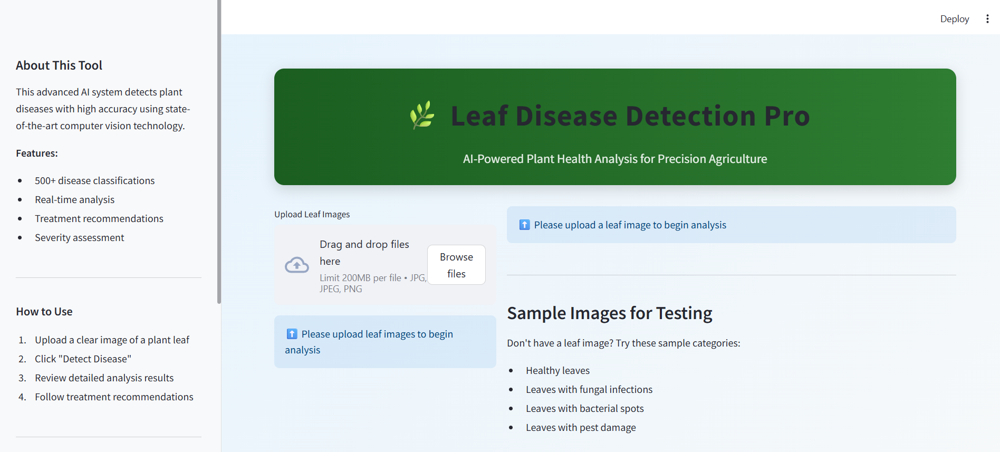
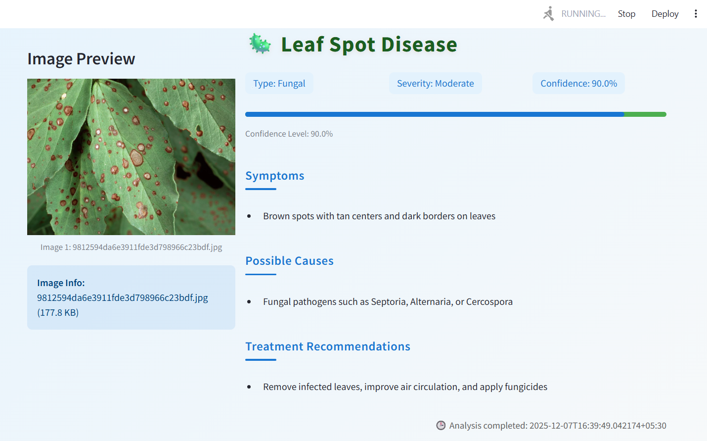
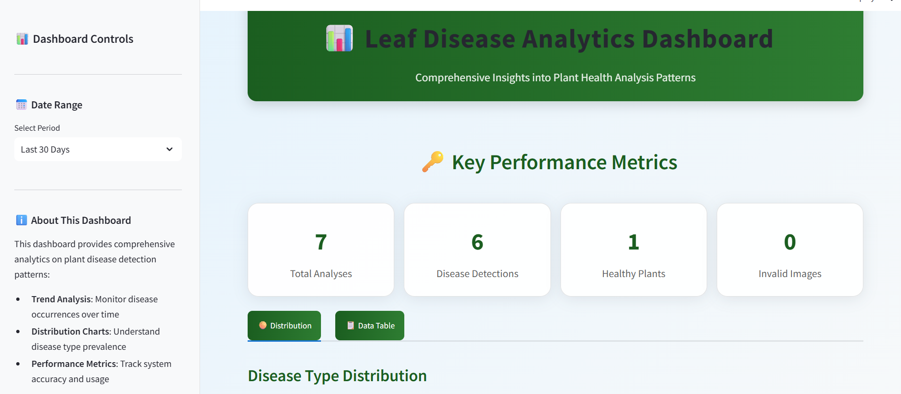
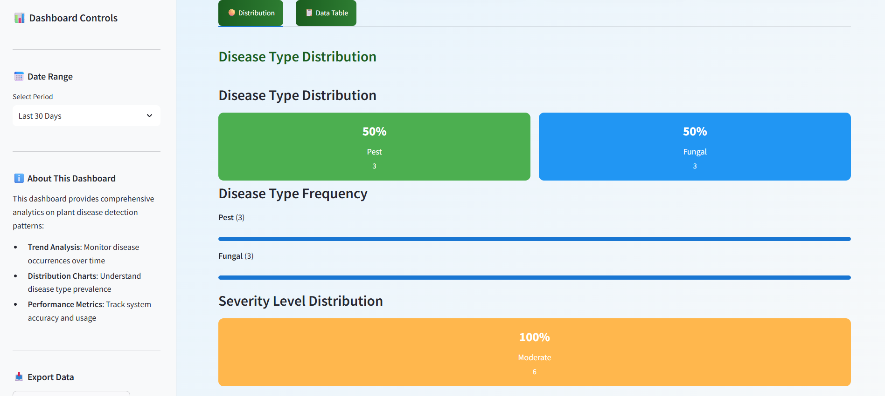
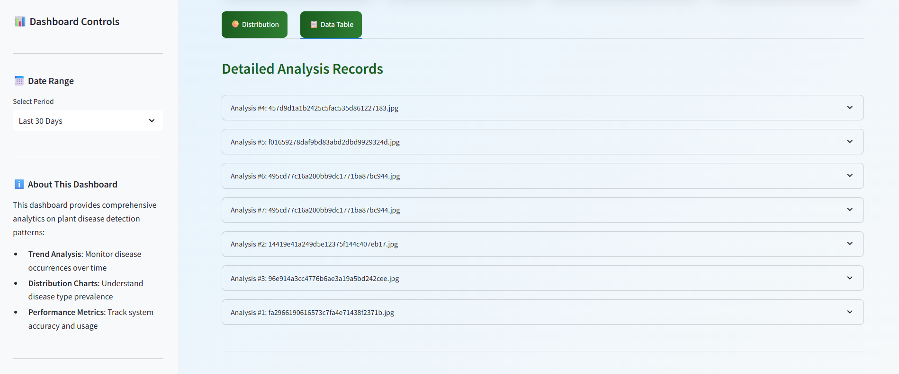

# 🌿 Leaf Disease Detection System Pro

<div align="center">
  
[](https://fastapi.tiangolo.com/)
[](https://streamlit.io/)
[](https://www.python.org/)
[](https://groq.com/)
[](LICENSE)

</div>


<p align="center">
  <em>Experience the power of AI-driven plant health analysis in action</em>
</p>

---

## 🎯 Key Features

### 🎯 Core Capabilities
- **🔍 Advanced Disease Detection**: Identifies 500+ plant diseases across multiple categories (fungal, bacterial, viral, pest-related, nutrient deficiencies)
- **📊 Precision Severity Assessment**: AI-powered classification of disease severity levels (mild, moderate, severe)
- **📈 High-Confidence Scoring**: Provides confidence percentages (0-100%) with advanced uncertainty quantification
- **💡 Expert Treatment Recommendations**: Evidence-based, actionable treatment protocols tailored to specific diseases
- **📋 Comprehensive Symptom Analysis**: Detailed visual symptom identification with causal relationship mapping
- **⚡ Real-time Processing**: Optimized inference pipeline with sub-5-second response times
- **💾 Analysis History**: Persistent storage and retrieval of all analyses
- **📊 Analytics Dashboard**: Visual insights into detection patterns and trends

### 🏗️ Architecture Components
- **FastAPI Backend (app.py)**: RESTful API service with automatic OpenAPI documentation
- **Streamlit Frontend (main.py)**: Interactive web interface with modern UI/UX design
- **Analytics Dashboard (dashboard.py)**: Data visualization and historical analysis
- **Core AI Engine (Leaf Disease/main.py)**: Advanced disease detection engine powered by Meta Llama Vision
- **Database Layer (database.py)**: SQLite-based persistence for analysis history
- **Utility Layer (utils.py)**: Image processing and data transformation utilities
- **Cloud Deployment**: Production-ready with Vercel integration and scalable architecture

---

## 📸 Screenshots

<div align="center">
  <h3>Main Application Interface</h3>
  
  
  <h3>Disease Detection Results</h3>
  
  
  <h3>Analytics Dashboard</h3>
  
  
  <h3>Distribution</h3>
  
  
  <h3>Data Table</h3>
  
</div>

---

## 🚀 Quick Start

### Prerequisites

- Python 3.8+
- Groq API Key ([Get one free here](https://console.groq.com/))

### Installation

1. **Clone the repository:**
   ```bash
   git clone https://github.com/shukur-alom/leaf-diseases-detect.git
   cd leaf-diseases-detect
   ```

2. **Create virtual environment:**
   ```bash
   python -m venv venv
   source venv/bin/activate  # On Windows: venv\Scripts\activate
   ```

3. **Install dependencies:**
   ```bash
   pip install -r requirements.txt
   ```

4. **Configure environment:**
   ```bash
   cp .env.example .env
   # Edit .env and add your Groq API key
   ```

### Running the Application

#### Option A: FastAPI Backend Only
```bash
uvicorn app:app --reload --port 8000
```
Access API documentation at: http://localhost:8000/docs

#### Option B: Streamlit Frontend Only
```bash
streamlit run main.py --server.port 8501
```
Access web interface at: http://localhost:8501

#### Option C: Analytics Dashboard
```bash
streamlit run dashboard.py --server.port 8502
```
Access dashboard at: http://localhost:8502

#### Option D: Full Stack (Recommended)
**Terminal 1:** Launch FastAPI Backend
```bash
uvicorn app:app --reload --port 8000
```

**Terminal 2:** Launch Streamlit Main Interface
```bash
streamlit run main.py --server.port 8501
```

**Terminal 3:** Launch Analytics Dashboard
```bash
streamlit run dashboard.py --server.port 8502
```

---

## 🧪 Testing & Validation

### Automated Testing Suite
**Run comprehensive tests:**
- API tests: `python test_api.py`
- Image processing: `python utils.py`
- Core detection: `python "Leaf Disease/main.py"`
- Database functionality: `python database.py`

### Manual Testing Options

#### Testing via Streamlit Interface
1. Launch the Streamlit app: `streamlit run main.py`
2. Upload test images from the Media/ directory
3. Verify results accuracy and response formatting

#### Testing via API Endpoints
**Test with sample image using cURL:**
- Windows PowerShell: `curl -X POST "http://localhost:8000/disease-detection-file" -H "accept: application/json" -H "Content-Type: multipart/form-data" -F "file=@Media/brown-spot-4 (1).jpg"`

**Test with Python requests:**
Use the requests library to POST a file to the disease-detection-file endpoint and print the JSON response.

---

## 📡 API Reference

### Streamlit Web Interface (main.py)

The Streamlit application provides an intuitive web interface for leaf disease detection:

#### Key Features:
- **Drag-and-drop image upload** with instant preview
- **Batch processing** for multiple images
- **Real-time disease analysis** with progress indicators
- **Professional result display** with modern CSS styling
- **Comprehensive disease information** including symptoms, causes, and treatments
- **Responsive design** optimized for desktop and mobile devices
- **Interactive data visualization** with confidence gauges
- **Export capabilities** to CSV and PDF formats

### FastAPI Backend Service (app.py)

#### POST /disease-detection-file
Upload an image file for comprehensive disease analysis.

**Request:**
- **Content-Type**: multipart/form-data
- **Body**: Image file (JPEG, PNG, WebP, BMP, TIFF)
- **Max Size**: 10MB per image

#### GET /
Root endpoint providing API information and status.

#### GET /analysis-history
Retrieve recent disease analysis history.

#### GET /stats
Retrieve statistics about disease analysis.

---

## 🌐 Production Deployment

### Vercel Deployment (Recommended)
This project is optimized for Vercel with the included vercel.json configuration.

#### Quick Deploy:
**Install Vercel CLI:**
- Command: `npm install -g vercel`

**Deploy:**
1. Login: `vercel login`
2. Deploy: `vercel`

### Docker Deployment
Build and run with Docker for containerized deployment:

```bash
docker build -t leaf-disease-detect .
docker run -p 8000:8000 -p 8501:8501 leaf-disease-detect
```

---

## 📝 License & Legal

This project is licensed under the **MIT License**. See the [LICENSE](LICENSE) file for complete terms and conditions.

---

<div align="center">

**🌱 Empowering Agriculture Through AI-Driven Plant Health Solutions 🌱**


[🚀 **Live Demo**](https://leaf-diseases-detect5.streamlit.app) • [🐛 **Report Issues**](https://github.com/shukur-alom/leaf-diseases-detect/issues) • [💡 **Request Features**](https://github.com/shukur-alom/leaf-diseases-detect/discussions)

**Star ⭐ this repository if it helped you protect your plants!**

</div>
